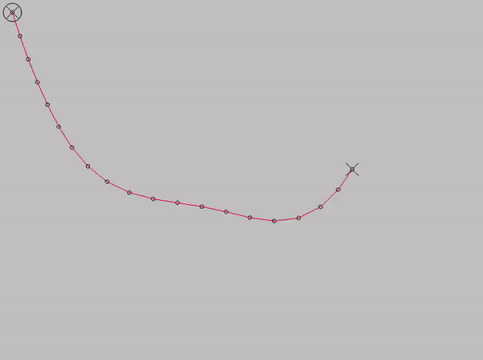
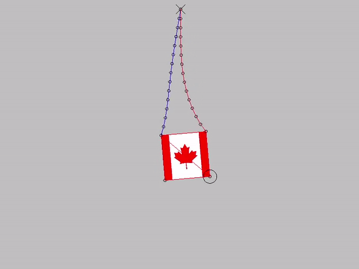

# gml-verlet-integration
A set of functions demonstrating [Verlet integration](https://en.wikipedia.org/wiki/Verlet_integration) in 2D and 3D spaces in Game Maker 8.1.

## Compatibility
Tested with `Game Maker 8.1 Standard`. Utilizes 'pro' functionality for Game Maker versions `8.1` and lower. Untested with `Game Maker Studio`.
